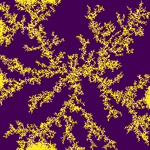
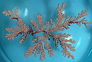

# dla

A Study of Diffusion-Limited Aggregation and approach to find stickiness k.

Diffusion-limited Aggregation (DLA) is an idealization of the process by which matter irreversibly combines to form dust, soot, dendrites and other random objects as in the case where the rate limiting step is diffusion of matter to the aggregate.

DLA can be observed in many systems such as electrodeposition, Hele-Shaw flow, mineral deposits, and dielectric breakdown.

Computer Generated DLA              |  A DLA cluster grown from a copper sulfate solution in an electrodeposition cell
:----------------------------------:|:--------------------------------------------------------------------------------:
      |  

See more in the presentation about the study https://docs.google.com/presentation/d/17A_gvxG1EmzdUL9KTa0zkYbnv27DJtntcj8UI-WBVXg/edit?usp=sharing

## Dependencies

`$ pip install -r requirements.txt`

##  Generating Simulations

Specify the range of stickiness(k) values and folder path to store results in `run_simulations.py` before running.

`$ python run_simulations.py`

1. `dla_sim_normal.py`  is the class file that is used to generate DLA simulations.
2. `utils.py` consists of utility functions to compute metrics such as Center Density, Neighbor Strength, Circular Mask etc.

## Approach

Approach to find stickiness is discussed detailed in https://docs.google.com/presentation/d/17A_gvxG1EmzdUL9KTa0zkYbnv27DJtntcj8UI-WBVXg/edit?usp=sharing.
To have a look at the implementation, please look into `Approach_to_find_stickiness.ipynb`.

## References

1. https://en.wikipedia.org/wiki/Diffusion-limited_aggregation
2. https://en.wikipedia.org/wiki/Brownian_motion
3. https://iamkush.me/dlasim/
4. http://paulbourke.net/fractals/dla/
